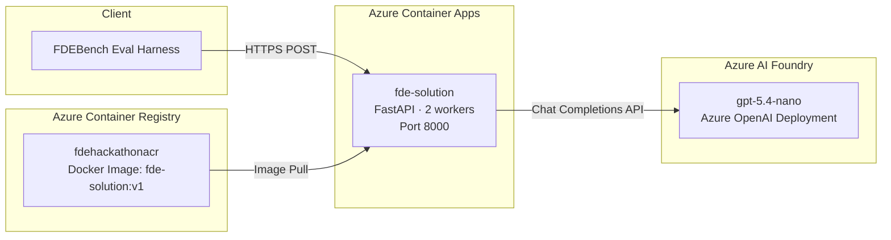
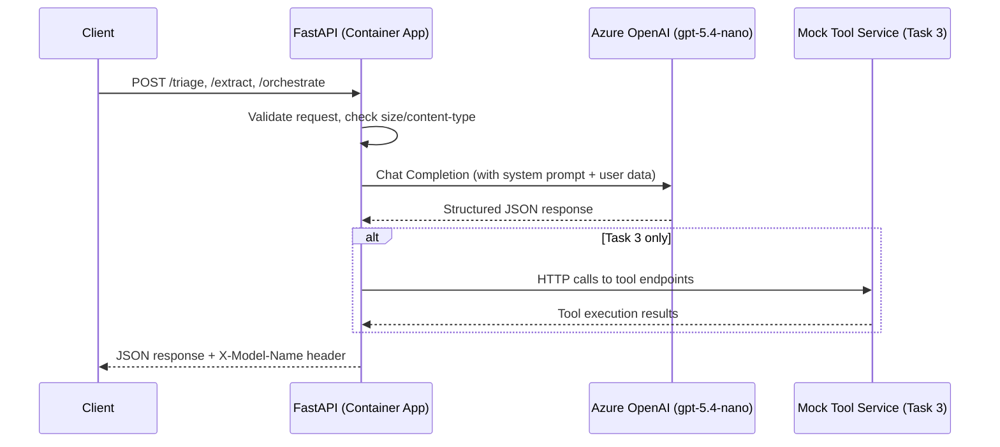

# FDEBench Solution — Be a Microsoft FDE for a Day

A production-deployed FastAPI service that solves three AI-powered business problems (Signal Triage, Document Extraction, Workflow Orchestration) scored by [FDEBench](docs/challenge/README.md).

**Live endpoint:** `https://fde-solution.braveglacier-ab8fc7b3.eastus2.azurecontainerapps.io`

---

## Solution Architecture

### Infrastructure Diagram



### Request/Response Flow



### Azure Resources Used

| Resource | Purpose |
|----------|---------|
| **Azure AI Foundry** | Hosts `gpt-5.4-nano` deployment for all LLM inference |
| **Azure Container Registry** | Stores the Docker image (`fde-solution:v1`) |
| **Azure Container Apps Environment** | Managed hosting with auto-TLS, scaling (1–3 replicas) |
| **Azure Container App** | Runs the FastAPI service, publicly accessible via HTTPS |

---

## API Endpoints

| Method | Path | Description |
|--------|------|-------------|
| `GET` | `/health` | Health check — returns `{"status": "ok"}` |
| `POST` | `/triage` | Classifies and routes noisy mission signals into structured routing decisions |
| `POST` | `/extract` | Extracts structured data from base64-encoded document images using vision |
| `POST` | `/orchestrate` | Plans and executes multi-step workflows with real HTTP tool calls |

All `POST` endpoints return an `X-Model-Name: gpt-5.4-nano` header for cost scoring.

### Resilience Features

- `415` for wrong `Content-Type`
- `413` for oversized payloads (>50 KB on non-extract routes)
- `422` for validation errors, `400` for malformed JSON
- Retry logic with exponential backoff on transient LLM errors (429, 5xx)
- 2 Uvicorn workers for concurrent request handling

---

## Repository Structure

```
├── py/
│   ├── apps/
│   │   ├── sample/              # The solution application
│   │   │   ├── main.py          # FastAPI app, routes, middleware
│   │   │   ├── config.py        # Pydantic settings (env vars)
│   │   │   ├── llm_client.py    # Azure OpenAI client + retry logic
│   │   │   ├── triage_service.py    # Task 1: LLM classification
│   │   │   ├── extract_service.py   # Task 2: Vision extraction
│   │   │   ├── orchestrate_service.py # Task 3: Plan + execute
│   │   │   └── models.py        # Pydantic request/response models
│   │   └── eval/                # Eval harness (scoring tool)
│   ├── common/libs/             # Shared libraries (models, fastapi helpers)
│   ├── data/                    # Test data + JSON schemas per task
│   ├── Dockerfile               # Production container image
│   └── Makefile                 # Dev commands (setup, run, eval)
├── docs/
│   ├── architecture.md          # System design and tradeoffs
│   ├── methodology.md           # Approach and iteration
│   └── evals.md                 # Scores and error analysis
├── implemention-docs/           # Internal design notes
└── infra/                       # IaC (Pulumi)
```

---

## Local Development

### Prerequisites

- Python 3.12+
- [uv](https://docs.astral.sh/uv/) (Python package manager)
- Azure OpenAI access (API key + endpoint)

### Setup & Run

```bash
cd py
make setup   # install all dependencies (once)
make run     # start the app on http://localhost:8000
```

### Run Evals Locally

In a second terminal:

```bash
cd py
make eval              # score all 3 tasks
make eval-triage       # Task 1 only
make eval-extract      # Task 2 only
make eval-orchestrate  # Task 3 only
```

### Environment Variables

Create `py/apps/sample/.env`:

```env
AZURE_OPENAI_ENDPOINT=https://your-resource.services.ai.azure.com
AZURE_OPENAI_API_KEY=your-key
AZURE_OPENAI_DEPLOYMENT=gpt-5.4-nano
AZURE_OPENAI_API_VERSION=2024-12-01-preview
MODEL_NAME=gpt-5.4-nano
```

---

## Deployed Endpoint Testing

Run the eval harness against the live Azure deployment:

```bash
cd py
uv run --package eval python apps/eval/run_eval.py --endpoint https://fde-solution.braveglacier-ab8fc7b3.eastus2.azurecontainerapps.io
```

Quick smoke test:

```bash
curl https://fde-solution.braveglacier-ab8fc7b3.eastus2.azurecontainerapps.io/health
# → {"status":"ok"}
```

---

## Deployment

The app is containerized and deployed to **Azure Container Apps** via **Azure Container Registry**.

```bash
# Build and push image to ACR (from py/ folder)
az acr build --registry fdehackathonacr --resource-group fdebench-rg --image fde-solution:v1 --file Dockerfile .
```

Container App configuration:
- **CPU:** 1 vCPU, **Memory:** 2 GiB
- **Min replicas:** 1 (avoids cold-start penalty)
- **Max replicas:** 3 (handles burst concurrency)
- **Ingress:** External HTTPS on port 8000
- **Environment variables:** Azure OpenAI credentials injected at deploy time

---

## Documentation

| Document | Description |
|----------|-------------|
| [docs/architecture.md](docs/architecture.md) | System design, AI pipeline, tradeoffs |
| [docs/methodology.md](docs/methodology.md) | Approach, iteration, what worked/failed |
| [docs/evals.md](docs/evals.md) | Scores, error analysis, limitations |

---

## License

[MIT](LICENSE)
