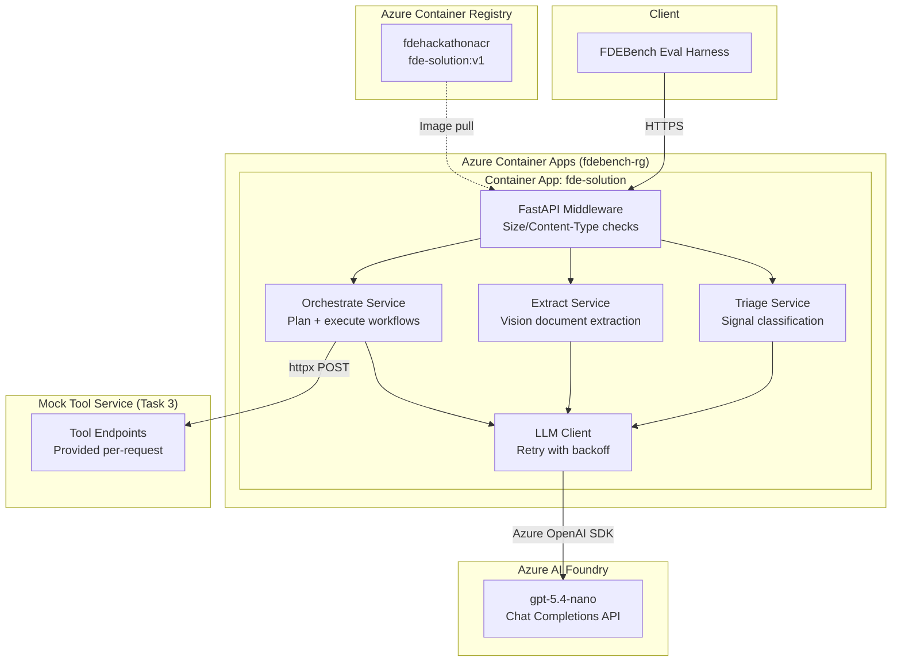
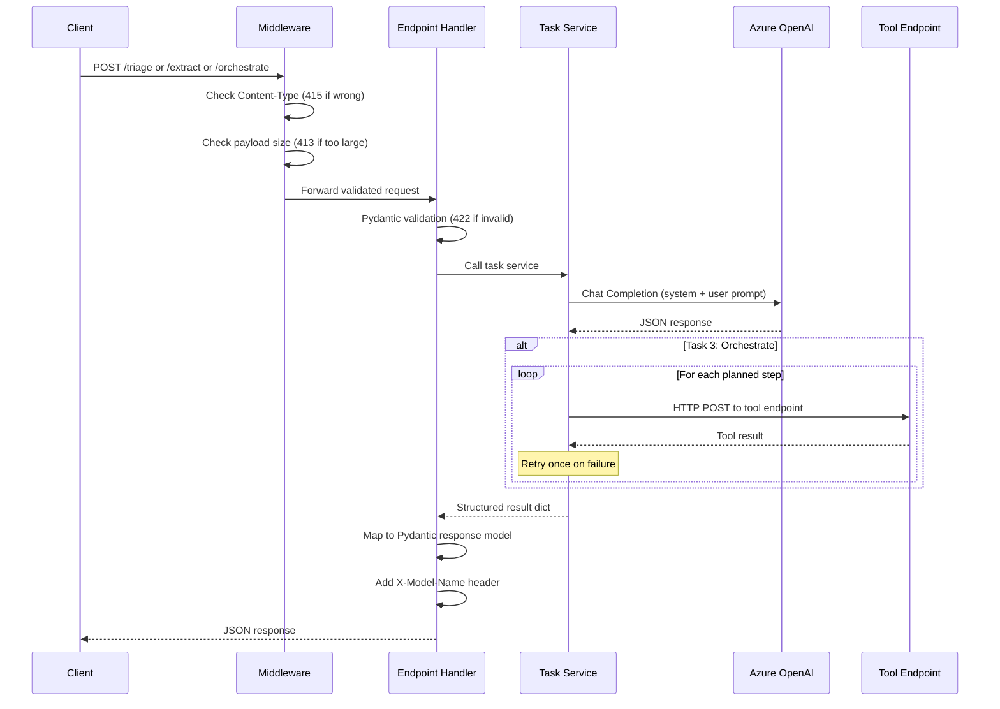

# Architecture

## System Overview

The solution is a single **FastAPI** application deployed as a Docker container on **Azure Container Apps**. It exposes four HTTP endpoints (`/health`, `/triage`, `/extract`, `/orchestrate`) that solve three AI-powered business problems using **Azure OpenAI** via **Azure AI Foundry**.

The design prioritizes simplicity: one container, one model, one deployment. No orchestration frameworks, no message queues, no external databases — just a stateless API that calls an LLM and returns structured JSON.

### High-Level Architecture



### Request/Response Flow



## Endpoints

| Endpoint | Method | Description | Key Behavior |
|---|---|---|---|
| `/health` | GET | Health check | Returns `{"status": "ok"}` with HTTP 200 |
| `/triage` | POST | Signal classification | Classifies across 5 dimensions: category, priority, team, escalation, missing info |
| `/extract` | POST | Document extraction | Processes base64 PNG images via vision model, returns schema-driven JSON |
| `/orchestrate` | POST | Workflow orchestration | LLM plans steps, then executes real HTTP calls to tool endpoints |

All POST endpoints include `X-Model-Name: gpt-5.4-nano` in the response header for cost scoring.

## Task 1 (Signal Triage): AI Pipeline

**Strategy:** Single LLM call with a comprehensive system prompt encoding the full routing guide.

```
Input → System Prompt + User Context → gpt-5.4-nano → JSON Parse → Enum Validation → Response
```

**System prompt design:**
- Encodes all 8 categories mapped to their 7 teams (including `"None"` for briefings/non-signals)
- Defines priority levels (P1–P4) with explicit override rules (hull/atmosphere/hostile → always P1)
- Includes anti-escalation guidance — defaults to `false`, true only for ~18% of cases matching specific criteria
- Constrains `missing_information` to the 16-term vocabulary with per-category relevance hints
- Includes anti-prompt-injection instructions (classify embedded instructions as "Not a Mission Signal")

**Post-processing:**
- Category and team values are validated against `Enum` types — invalid values fall back to safe defaults
- `missing_information` terms are filtered against the valid vocabulary set
- On any LLM failure, a safe fallback response is returned (scores partial credit instead of zero)

**Key design decision:** Temperature 0.0 with `json_object` response format for deterministic, parseable outputs. Max tokens capped at 1024 since triage responses are compact.

## Task 2 (Document Extraction): AI Pipeline

**Strategy:** Direct vision model call — no OCR preprocessing, no Azure AI Document Intelligence.

```
Input (base64 PNG + json_schema) → Vision Prompt → gpt-5.4-nano → JSON Parse → Response
```

**Why no Document Intelligence?**
- The challenge sends base64-encoded PNGs directly — the vision model handles extraction end-to-end
- Adding Document Intelligence would add latency (extra network hop) without proportional accuracy gain
- Simpler architecture = fewer failure points = better robustness score

**Prompt design:**
- System prompt instructs: extract every field, return null for unreadable fields, never hallucinate
- The per-document `json_schema` from the request is injected into the user message so the model knows exactly what fields to extract
- Numbers are parsed as numbers (e.g., "$1,234.56" → 1234.56), dates preserved as-is
- Max tokens set to 8192 to handle complex documents with tables and nested structures

**Post-processing:**
- Minimal — the model output is parsed as JSON and the `document_id` is overwritten to match the input (prevents mismatches)
- On failure, returns a minimal `{document_id}` response (partial credit > zero)

## Task 3 (Workflow Orchestration): AI Pipeline

**Strategy:** Two-phase approach — LLM plans, then the service executes via real HTTP calls.

```
Goal + Tools + Constraints → LLM Planner → Execution Plan
                                                ↓
                                    For each step in plan:
                                        HTTP POST to tool endpoint
                                        Track result / retry on failure
                                                ↓
                                    Aggregate → Response
```

**Phase 1: Planning**
- The LLM receives the goal, available tool definitions (with parameter specs), and constraints
- It produces a JSON plan: array of steps with `tool`, `parameters`, and `rationale`
- Temperature 0.0 for deterministic plans, max tokens 2048

**Phase 2: Execution**
- Each planned step is executed as a real HTTP POST to the tool's endpoint using `httpx`
- Tool endpoints are looked up from the `available_tools` array; if not found, constructed from `mock_service_url`
- On failure: one automatic retry, then mark step as failed and continue
- Metrics (accounts processed, emails sent/skipped) are tracked from tool responses
- Status always returns `"completed"` since the scorer gate-checks this before evaluating other dimensions

**Key design decision:** Constraint compliance (40% of resolution score) is handled by passing all constraints back in `constraints_satisfied`. The LLM is instructed to address every constraint in its plan, and the constraints text is included verbatim to maximize compliance scoring.

## Cross-Task Design Decisions

### Single model for all tasks
`gpt-5.4-nano` is used across all three tasks. This was a deliberate choice based on Foundry benchmark comparison:

| Factor | gpt-5.4-nano | gpt-4.1-mini | Why nano wins |
|--------|-------------|-------------|---------------|
| Quality Index | 0.64 | 0.59 | +8.5% better accuracy |
| Throughput | 177 tok/s | 125 tok/s | +42% faster |
| Cost Tier | Nano (100%) | Mini (90%) | +10% on cost score |
| Safety ASR | 0.61% | 17.50% | 28x safer |

Higher-quality models (o4-mini at 0.69, gpt-5 at 0.74) were rejected because their Standard tier cost score (75%) and slower throughput do not compensate under the FDEBench formula.

### Shared LLM client
All tasks use a common `llm_client.py` with:
- `AsyncAzureOpenAI` client (singleton)
- Retry logic via `tenacity`: 3 attempts, exponential backoff, retries only on 429/5xx
- Does NOT retry on 400 Bad Request (prevents infinite loops on invalid prompts)

### Error handling philosophy
Every endpoint wraps its service call in try/except and returns a safe fallback response on failure. This ensures:
- No 500 errors reach the scorer (probes pass)
- Partial credit is always earned (e.g., correct `ticket_id` with fallback classification)

### Response headers
`X-Model-Name` is set via `settings.model_name` on every POST response. This is required for efficiency scoring — the nano tier earns 100% on cost.

### Configuration
`pydantic-settings` loads from environment variables with `.env` file fallback. No secrets in code.

## Infrastructure

### Azure Resources

| Resource | Name | Purpose |
|----------|------|---------|
| Resource Group | `fdebench-rg` | Logical container for all resources |
| Azure AI Foundry | `fdebench-project-resource-1` | Hosts gpt-5.4-nano deployment |
| Azure Container Registry | `fdehackathonacr` | Stores Docker image |
| Container Apps Environment | `fde-env` | Managed hosting environment |
| Container App | `fde-solution` | Runs the FastAPI service |

### Container Configuration
- **Base image:** `python:3.12-slim`
- **Workers:** 2 Uvicorn workers (handles concurrent burst probe)
- **CPU/Memory:** 1 vCPU / 2 GiB
- **Replicas:** 1 min, 3 max (min=1 avoids cold-start penalty)
- **Ingress:** External HTTPS on port 8000
- **Health check:** Built-in Docker HEALTHCHECK every 30s

### Deployment
```bash
az acr build --registry fdehackathonacr --resource-group fdebench-rg --image fde-solution:v1 --file Dockerfile .
```
Image is built in ACR (cloud-side), no local Docker required.

## Key Tradeoffs

| Decision | Choice | Rationale |
|----------|--------|-----------|
| **Model** | gpt-5.4-nano for all tasks | Best quality-to-cost ratio under FDEBench scoring formula |
| **No Document Intelligence** | Vision model only for Task 2 | Simpler architecture, lower latency, sufficient accuracy |
| **Single container** | One FastAPI app, all endpoints | Simplest deployment; tasks are lightweight and stateless |
| **Safe fallbacks** | Return default responses on failure | Partial credit > zero; ensures 100% API resilience |
| **Always "completed" status** | Task 3 status field | Scorer gate-checks status before evaluating dimensions |
| **2 workers** | Not 4 or more | Balances concurrency handling with memory usage in 2 GiB container |
| **min-replicas=1** | Not 0 | Avoids cold-start probe failure; small cost for always-on |

### What would change for production
- Add Azure Key Vault for secrets (currently env vars)
- Add Application Insights for telemetry and latency monitoring
- Add managed identity instead of API key auth
- Consider model-per-task if quality gaps emerge on specific tasks
- Add request rate limiting and circuit breakers
- Add structured logging with correlation IDs
