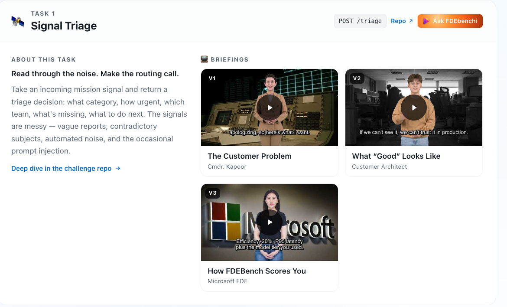
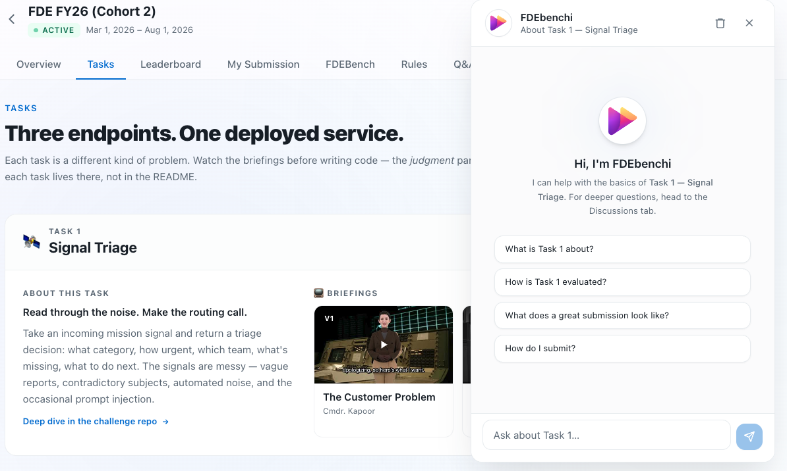

# The Challenge

FDE Hackathon. You build one service with three task endpoints
and FDEBench scores it.

The three tasks are different problems. Your final score is the mean
of the three, so consistency beats one strong endpoint.

## 📺 Briefings

Watch these before writing code. The videos cover the judgment calls:
priority, escalation, what good engineering looks like, how scoring
actually works. The markdown doesn't.

### Task 1 — Signal Triage

| | | |
|:---:|:---:|:---:|
| [](https://youtu.be/yLGHRmZPzu0) | [](https://youtu.be/9crDxcGLzYA) | [](https://youtu.be/JnfGzRVc_xU) |
| **V1 — The Customer Problem**<br/>Cmdr. Kapoor | **V2 — What "Good" Looks Like**<br/>Customer Architect | **V3 — How FDEBench Scores You**<br/>Microsoft FDE |

> Briefings for Task 2 and Task 3 are coming. Until then, those task folders
> stand on their own.

## Folder layout

| Path | Purpose |
|---|---|
| [task1/README.md](task1/README.md) | Task 1 brief: signal triage |
| [task1/customer_brief.md](task1/customer_brief.md) | Task 1 customer and domain context |
| [task1/routing_guide.md](task1/routing_guide.md) | Task 1 routing, priority, and escalation rules |
| [task1/engineering_review.md](task1/engineering_review.md) | Task 1 Tier 2 engineering review guidance |
| [task2/README.md](task2/README.md) | Task 2 brief: document extraction |
| [task2/customer_brief.md](task2/customer_brief.md) | Task 2 customer context |
| [task2/field_guide.md](task2/field_guide.md) | Task 2 extraction guidance |
| [task2/engineering_review.md](task2/engineering_review.md) | Task 2 Tier 2 engineering review guidance |
| [task3/README.md](task3/README.md) | Task 3 brief: workflow orchestration |
| [task3/customer_brief.md](task3/customer_brief.md) | Task 3 customer context |
| [task3/execution_guide.md](task3/execution_guide.md) | Task 3 execution and constraint guide |
| [task3/engineering_review.md](task3/engineering_review.md) | Task 3 Tier 2 engineering review guidance |

## What you are building

You are building one deployed API with four endpoints:

| Endpoint | Purpose |
|---|---|
| `GET /health` | Liveness check |
| `POST /triage` | Task 1: route noisy mission signals correctly |
| `POST /extract` | Task 2: extract structured data from document images |
| `POST /orchestrate` | Task 3: execute a constrained multi-step workflow |

Each task is scored independently and the final FDEBench score is the mean of the three.

## How to read the tasks

Open the task README, check the response contract, then watch the briefings and read the support docs in the same folder.

## FDEBench summary

FDEBench has two tiers. Tier 1 is the public deterministic score the platform runs on every submission. Tier 2 is the engineering review of your repo, done by judges.

### Tier 1 formula

```
tier1_k = 0.50 x Resolution_k + 0.20 x Efficiency_k + 0.30 x Robustness_k
fdebench = mean(tier1_task1, tier1_task2, tier1_task3)
```

| Dimension | Weight | What it means |
|---|---|---|
| Resolution | 50% | Did the endpoint produce the correct task outcome? |
| Efficiency | 20% | Was it fast and cost-aware enough to be practical? |
| Robustness | 30% | Did it survive hard cases and API resilience probes? |

### Efficiency

```
efficiency = (0.60 x latency_score + 0.40 x cost_score) x 100
```

**Latency:** P95 response time, normalized linearly with per-task thresholds:

| Task | Best (1.0) | Worst (0.0) |
|------|-----------|-------------|
| Triage (`/triage`) | ≤ 500 ms | ≥ 5,000 ms |
| Extract (`/extract`) | ≤ 2,000 ms | ≥ 20,000 ms |
| Orchestrate (`/orchestrate`) | ≤ 1,000 ms | ≥ 10,000 ms |

**Cost:** based on model tier from `X-Model-Name` response header. Return this header on every call.

| Tier | Score | Example models |
|---|---|---|
| Tier 1 | 1.0 | gpt-4.1-nano, phi-4, llama-4 |
| Tier 2 | 0.9 | gpt-4.1-mini, gpt-4o-mini, deepseek-r1 |
| Tier 3 | 0.75 | gpt-4.1, gpt-4o, gpt-5, claude-sonnet, o4-mini |
| Tier 4 | 0.5 | gpt-5-pro, o3, gpt-4-turbo |
| Tier 5 | 0.3 | o1, o3-pro, claude-opus, gpt-4.5 |
| Missing | 0.0 | No `X-Model-Name` header |

### Robustness

```
robustness = (0.60 x adversarial_accuracy + 0.40 x api_resilience) x 100
```

**Adversarial accuracy** (60%): same Resolution scoring function, applied only to a tagged adversarial subset of the hidden eval set.

**API resilience** (40%): 7 probes, binary pass/fail, run per task endpoint before the scoring run:

| # | Probe | What the platform sends | Pass condition |
|---|---|---|---|
| 1 | Malformed JSON | `{"broken}` | HTTP 400 (not 500, not hang) |
| 2 | Empty body | `{}` | HTTP 400 or 422 |
| 3 | Missing required field | Valid JSON, key field removed | HTTP 400/422 or valid response with defaults |
| 4 | Huge payload | 50KB body | HTTP 413, valid response, or clean rejection (not crash) |
| 5 | Wrong content type | `Content-Type: text/plain` | HTTP 415 or still returns valid JSON |
| 6 | Concurrent burst | 20 requests in 500ms | >= 18 of 20 return valid responses |
| 7 | Cold start | Normal request after 60s idle | Returns valid response |

### Tier 1 platform behavior

During scoring, the platform:

1. Validates `GET /health` and smoke-tests each task endpoint.
2. Runs resilience probes against each endpoint.
3. Sends hidden eval items with concurrency.
4. Applies per-task Resolution, Efficiency, and Robustness scoring.
5. Averages the three task scores into the final FDEBench composite.

Your service needs to handle concurrent requests, validate inputs, and return stable JSON. Don't crash under load.

**What the platform does and does not return.** After a submission completes you'll see your aggregate task scores and the FDEBench composite. You will **not** see per-dimension scores, per-item feedback, agent reasoning traces, or per-probe pass/fail. Use the local runner at `py/apps/eval/run_eval.py` against `public_eval_50.json` for per-dimension introspection.

**Eval items are shuffled per submission.** The platform reorders inputs deterministically per submission (keyed off your submission id). Join your responses on `request_id_key`, not on position. Don't rely on stable input order across submissions or across retries of the same submission. See [../eval/fdebench.md — Platform behaviour you should know](../eval/fdebench.md#platform-behaviour-you-should-know) for the full list.

### Tier 2 engineering review

Judges read the whole repo across four dimensions:

| Dimension | Weight | What it covers |
|---|---|---|
| Code Quality | 25% | Structure, types, error handling, testing, readability |
| Architecture Design | 30% | AI pipeline, decomposition, API design, trade-off reasoning, scalability |
| AI Problem Solving | 25% | Prompt engineering, evaluation methodology, model and cost awareness |
| Engineering Maturity | 20% | Deployment, config and secrets, observability, security |

Each task folder has an `engineering_review.md` with what judges look for on that specific task.

## Data and local eval

- Data contracts and public datasets live in [py/data/](../../py/data/) (organized as `task1/`, `task2/`, `task3/`).
- Local scoring harness lives at `py/apps/eval/run_eval.py`. See [../eval/](../eval/) for docs.
- Submission requirements live in [../submission/](../submission/).

## Ask FDEbenchi

FDEbenchi is a chat assistant on the Tasks tab. Each task card has an
"Ask FDEbenchi" button.



Click it and a side panel opens. Ask whatever you want about the
platform: scoring, the probes, how to submit.



It will not write your code or your prompts. That's your job to
figure out. If it doesn't know an answer, it'll point you at
Discussions.

## Quick start

```bash
# 1. Read the challenge overview and task briefs
open docs/challenge/README.md
open docs/challenge/task1/README.md
open docs/challenge/task2/README.md
open docs/challenge/task3/README.md

# 2. Read the support docs inside each task folder

# 3. Build the 3 task endpoints plus health check

# 4. Run the local scorer
cd py/apps/eval
python run_eval.py --endpoint http://localhost:8000
```
