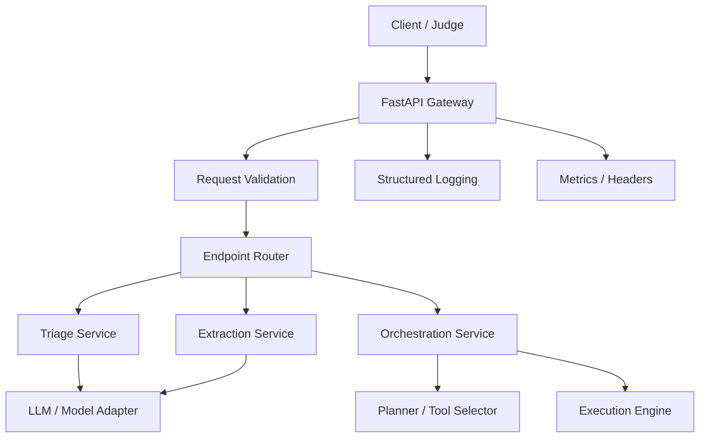
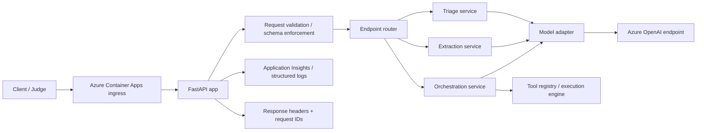

# FDEBench Solution Plan

## 1. What the challenge is really asking for

This is not just a chatbot demo. The judging setup expects a production-style API service with three endpoints and strong engineering discipline.

The deliverables are:
- One deployed service
- Health endpoint
- Three task endpoints:
  - POST /triage
  - POST /extract
  - POST /orchestrate
- Clean contracts
- Robust failure handling
- Observability headers
- Tests and documentation
- Deployment readiness

The scoring makes three things very clear:
1. Accuracy matters most.
2. Speed and cost matter a lot.
3. Robustness and reliability are mandatory, not optional.

---

## 2. Requirement clarity

### A. Triage endpoint

Purpose:
- Receive a messy mission signal
- Return a structured triage decision

Expected behavior:
- Classify the signal into a fixed category
- Determine urgency from P1 to P4
- Assign the signal to the correct team
- Identify missing information from a controlled vocabulary
- Flag escalation when necessary
- Return a concise next action or remediation

Important constraints:
- Avoid free-form prose in the final decision fields
- Use controlled enums and vocabulary
- Handle ambiguous or adversarial inputs
- Return proper HTTP errors for bad input

### B. Extract endpoint

Purpose:
- Accept a base64-encoded document image (always `image_base64` format)
- Extract structured fields using a vision-capable LLM
- Return validated JSON matching the per-document `json_schema`

Expected behavior:
- Parse receipts, invoices, forms, or chart-like documents
- Read the `json_schema` from the request to know exactly what fields to extract
- Produce structured output fields matching the schema
- Preserve textual fidelity where possible
- Return `null` for fields that cannot be extracted (never hallucinate)

Important constraints:
- The output schema varies per document — cannot hardcode field names
- ~36% of documents are adversarial (handwritten, degraded, photographed)
- Numbers should be parsed as numbers, not strings
- Must handle AOAI 429 throttling with custom retry logic

### C. Orchestrate endpoint

Purpose:
- Interpret a workflow goal
- Read the `available_tools` provided dynamically in each request
- Plan and execute tool calls via real HTTP requests
- Respect constraints and track state across steps

Expected behavior:
- Use the LLM to produce an execution plan from the goal + tools + constraints
- Actually call each tool's `endpoint` via HTTP (URLs are rewritten by the platform)
- Track step results, handle failures, compute counts
- Return a structured execution summary with `steps_executed` and `constraints_satisfied`

Important constraints:
- Must make REAL HTTP calls to tool endpoints — the scorer checks actual execution
- Constraint compliance is 40% of the resolution score — the largest single dimension
- Parameters must be computed from tool responses, not copied from the goal
- Handle tool failures gracefully (retry, skip, partial status)

### D. Shared service requirements

Across all endpoints:
- Input validation and schema enforcement
- Standardized error responses
- Request IDs and structured logs
- Cost and latency metadata headers
- Health and readiness endpoint
- Container-based deployment

---

## 3. Proposed architecture

### High-level design

The service will follow a layered architecture:



### Why this structure

This keeps the HTTP boundary separate from the business logic, which is exactly what the challenge brief recommends. It also makes the code easier to test and easier to adapt when the hidden evaluation uses slightly different schemas.

---

## 4. Recommended technology stack

### Core runtime
- Python 3.12+
- FastAPI
- Uvicorn
- Pydantic

Why:
- Python is the most common choice for this type of hackathon and fits the brief well.
- FastAPI gives us clean routing, dependency injection, async support, and strong schema validation.
- Pydantic makes responses and request models explicit, which is important for deterministic evaluation.
- Async support is useful for handling concurrent bursts and for model calls that may wait on network I/O.

### LLM integration
- A provider abstraction layer
- Default target: Azure OpenAI or OpenAI-compatible API

Why:
- The challenge explicitly cares about model identity and cost tier metadata.
- A provider abstraction lets us swap models without rewriting business logic.
- Azure OpenAI is a strong option if deployment is going to be Azure-based, but OpenAI is also fine for a fast MVP.

### OCR and document extraction
- Use a vision-capable LLM (gpt-5.4-nano or gpt-4.1-mini) for end-to-end document extraction
- The model receives the base64 image + the per-document `json_schema` and returns structured JSON
- **Do NOT use Azure AI Document Intelligence** — the challenge sends base64 images directly and a vision model handles extraction without an extra service

Why:
- The challenge platform always sends `content_format: "image_base64"` — there is no file upload or URL flow
- A single vision model call is simpler, lower latency, and sufficient for the document types in the eval set
- Adding Document Intelligence would add a second Azure resource, extra latency, extra retry logic, and no measurable accuracy gain
- If accuracy on degraded/handwritten documents is too low, we can improve via prompt engineering or model upgrade before adding infrastructure

### Orchestration layer
- A tool registry with typed tool definitions
- A planner module that selects tools
- An executor that runs them step-by-step

Why:
- The coordinator should not be a single giant function.
- A tool registry makes it easier to add or swap capabilities later.
- The execution loop can be deterministic and easier to test than a fully free-form agent workflow.

### Observability and reliability
- Structured logging
- Request IDs
- Response headers such as:
  - X-Model-Name
  - X-Latency-Ms
  - X-Token-Count
  - X-Request-Id
- Optional OpenTelemetry integration

Why:
- The brief explicitly calls for observability headers.
- Logging and tracing are essential for both the hidden evaluation and the engineering review.

### Deployment
- Docker
- Azure Container Apps
- Azure Container Registry
- Azure Key Vault
- Azure Monitor / Application Insights

Why:
- The challenge example explicitly references Azure Container Apps.
- Containerization is required for reproducibility and portability.
- Azure Container Apps is a good fit for a lightweight API service with bursty traffic and easy environment variable configuration.
- Azure Key Vault keeps secrets out of source control and aligns well with production expectations.
- Application Insights gives us the observability story the challenge wants.

### Azure-first implementation recommendation
Given your free Azure credits and the Microsoft nature of the hackathon, I recommend we build the solution around Azure-native services from the start:
- Deploy the FastAPI service to Azure Container Apps.
- Store secrets in Azure Key Vault.
- Use Azure OpenAI or an Azure AI model endpoint for LLM calls (including vision for extraction).
- Enable Application Insights for request tracing and basic telemetry.

This is a strong fit because it keeps the stack aligned with the platform, reduces deployment friction, and makes the solution look production-ready for both the judges and the engineering review.

---

## 5. Design principles for this solution

### 1. Strong contracts over free-form output
Every endpoint should return structured JSON with explicit schemas.

### 2. Model cost awareness
We should not always use the most expensive model. The architecture should support:
- small model for simple triage
- more capable model only when confidence is low or the input is ambiguous
- deterministic rules first, model second

### 3. Fail loudly and safely
Bad requests should return clean 4xx responses. Infrastructure issues should return controlled error payloads.

### 4. Keep prompts separate from transport code
Prompt templates should live in dedicated files and be injected into service logic, not embedded inside handlers.

### 5. Make the code reviewable
The repository should clearly separate:
- API layer
- service logic
- model adapters
- schemas
- prompts
- tests

### 6. Failure handling and resilience by design
This challenge is very explicit about the API probes, so failure handling should be treated as a first-class requirement.

#### Expected behavior for the 7 probes
- Malformed JSON -> return 400 with a structured error payload
- Empty body -> return 400 or 422 with a clear validation message
- Missing fields -> return 400 or 422, or apply safe defaults if the contract allows them
- 50KB payload -> reject with 413 Request Entity Too Large
- Wrong content-type -> return 415 Unsupported Media Type
- Concurrent burst -> support burst traffic with bounded concurrency and graceful degradation; target at least 18 valid responses out of 20 requests in the probe window
- Cold start -> ensure the app starts quickly, handles first request correctly, and does not fail after idle time

#### Implementation approach
- Add request-size limits at the FastAPI layer
- Validate content-type before parsing JSON
- Catch JSON decoding errors explicitly and return controlled 4xx responses
- Use Pydantic validation for required fields and malformed bodies
- Apply timeouts to downstream model and OCR calls
- Use async processing and a worker/queue pattern where needed to avoid blocking under burst traffic
- Add a circuit breaker or fallback path for model/provider failures
- Return a consistent error envelope such as:
  - error_code
  - message
  - details
  - request_id

#### Operational behavior
- Health endpoint should report readiness and liveness separately
- Failures should be logged with request IDs and enough context for debugging
- The service should never crash on invalid input; it should degrade gracefully

This is important because robustness contributes 30% of the score and these probes are low-effort, high-impact wins.

---

## 6. Recommended API shape

### Health
- GET /health
- Returns simple status and service metadata

### Triage
- POST /triage
- Input:
  - signal text
  - optional metadata (source, timestamp, context)
- Output:
  - category
  - priority
  - team
  - missing_info
  - escalation
  - action

### Extract
- POST /extract
- Input:
  - document_id
  - content (base64-encoded PNG image)
  - content_format (always "image_base64")
  - json_schema (JSON schema string describing expected output fields, varies per document)
- Output:
  - document_id (must match input)
  - all fields specified by the per-document json_schema
  - null for fields that cannot be extracted

### Orchestrate
- POST /orchestrate
- Input:
  - goal
  - available tools
  - constraints
  - optional context
- Output:
  - plan
  - executed steps
  - final result
  - errors and fallback behavior

---

## 7. Suggested implementation sequence

### Phase 1 — Foundation
- Set up FastAPI app
- Add health endpoint
- Add request validation and error handling
- Add logging and request IDs
- Add Dockerfile and environment config

### Phase 2 — Triage MVP
- Implement controlled input/output schemas
- Add model adapter
- Add prompt templates
- Add tests for normal and adversarial inputs
- Add observability headers

### Phase 3 — Extraction MVP
- Add base64 image decoding
- Add vision model integration (send image + json_schema to LLM)
- Add dynamic schema-based extraction logic
- Add value normalization (numbers as numbers, whitespace collapsing)
- Add retry logic for AOAI 429 throttling

### Phase 4 — Orchestration MVP
- Define tool registry and execution model
- Add planning logic
- Add execution engine with step-level error handling
- Add constraint checks

### Phase 5 — Hardening
- Resilience probes
- Concurrency testing
- Latency tuning
- Documentation and deployment validation

---

## 8. Testing strategy

We should not rely only on happy-path tests.

### Core test categories
- Unit tests for schemas and adapters
- Tests for prompt formatting and response parsing
- Tests for bad input handling
- Tests for model failure handling
- Concurrency and burst tests
- Cold start behavior checks
- End-to-end smoke tests for each endpoint

This is important because the challenge explicitly mentions malformed JSON, empty bodies, missing fields, huge payloads, wrong content types, concurrent bursts, and cold start resilience.

---

## 9. Documentation deliverables

The submission package should include:
- README.md
- docs/architecture.md
- docs/methodology.md
- docs/evals.md

These should explain:
- what the service does
- how it is structured
- why the chosen stack was used
- what was tested
- how the deployment works
- what limitations remain

---

## 10. Azure-specific system design

### 10.1 High-level Azure architecture

The solution will be deployed as a containerized FastAPI application on Azure Container Apps.

#### Core Azure components
- Azure Container Apps
  - Hosts the web API
  - Handles HTTP ingress and autoscaling
- Azure Container Registry
  - Stores the application container image
- Azure Key Vault
  - Stores API keys, secrets, and configuration values
- Azure OpenAI or Azure AI Foundry model endpoint
  - Provides the LLM capability for triage, extraction (vision), and orchestration
- Application Insights
  - Captures logs, traces, and metrics
- Managed identity
  - Used to authenticate the app to Azure services without storing secrets in code

### 10.2 Component threading

The request flow will look like this:



### 10.3 Service structure

The codebase should be organized as follows:

```text
app/
  api/
    routes.py
    dependencies.py
    errors.py
  core/
    config.py
    logging.py
    security.py
    telemetry.py
  schemas/
    triage.py
    extract.py
    orchestrate.py
    common.py
  services/
    triage_service.py
    extract_service.py
    orchestrate_service.py
  integrations/
    llm_client.py
  prompts/
    triage_prompt.txt
    orchestrate_prompt.txt
  tests/
    test_triage.py
    test_extract.py
    test_orchestrate.py
  Dockerfile
  requirements.txt
  README.md
```

This separation keeps the HTTP layer, business logic, integrations, and prompts independent.

### 10.4 Deployment flow

The deployment flow should be:

1. Write code and tests locally.
2. Build the container image.
3. Push the image to Azure Container Registry.
4. Deploy or update the Azure Container App.
5. Inject secrets from Azure Key Vault into the app environment.
6. Enable Application Insights and verify health endpoints.
7. Run smoke tests against the deployed endpoint.

#### Deployment sequence
```text
Local dev -> Docker build -> ACR push -> Container Apps deploy -> Key Vault secrets -> Health checks -> Smoke tests
```

### 10.5 Environment variables to define

The app should use environment variables for:
- AZURE_OPENAI_ENDPOINT
- AZURE_OPENAI_API_KEY or managed identity configuration
- AZURE_OPENAI_DEPLOYMENT_NAME
- AZURE_OPENAI_API_VERSION
- APPLICATIONINSIGHTS_CONNECTION_STRING
- KEY_VAULT_URI
- MAX_REQUEST_BODY_SIZE
- MODEL_TIMEOUT_SECONDS
- MODEL_NAME (for X-Model-Name response header)

### 10.6 Model selection strategy

We should not decide the model blindly. The selection should be based on three factors:

1. Accuracy need
   - Triage and orchestration often need reasoning quality.
   - Extraction may need strong instruction-following and schema compliance.

2. Cost efficiency
   - Use the smallest capable model for simple cases.
   - Use a more capable model only when confidence is low or the input is complex.

3. Latency requirement
   - The benchmark values low latency.
   - Larger models may improve quality but hurt efficiency.

#### Recommended model approach
- Use a smaller model first for triage on straightforward inputs.
- Use a more capable model for ambiguous cases, escalation-heavy inputs, or low-confidence outputs.
- Keep the model choice abstracted behind a single adapter so we can swap models later without rewriting the service.

#### Practical Azure model strategy
- Start with a lightweight Azure OpenAI deployment for triage and orchestration.
- Evaluate whether the same model is enough for extraction or whether a stronger model is warranted.
- If cost becomes a concern, add a simple policy layer:
  - simple input -> small model
  - complex input -> larger model
  - fallback -> deterministic rules or a cached response when available

This gives us a strong balance between accuracy, latency, and cost.

### 10.7 How the app should handle failures in Azure

The Azure deployment should make resilience explicit:
- Request validation should reject bad payloads before hitting the model
- Timeouts should cap model calls
- Failures should be logged with correlation IDs
- The app should return structured 4xx/5xx responses rather than crashing
- Container Apps should be configured with health probes so restarts and recovery are controlled

### 10.8 Why this design is strong

This architecture is a good match because it combines:
- Azure-native deployment
- clean service boundaries
- cost-aware model use
- strong error handling
- observability
- enough flexibility to iterate quickly

---

## 11. Open points — RESOLVED

All open points have been resolved by analyzing the challenge repository:

1. ~~Whether we will use Azure OpenAI directly or Azure AI Foundry-style deployment endpoints~~ → **Use Azure AI Foundry for model access. The app uses the OpenAI-compatible SDK either way.**
2. ~~Whether extraction will use document upload or document URL input first~~ → **Always `image_base64`. Platform always sends base64-encoded PNG. Confirmed in challenge docs.**
3. ~~Whether the orchestration flow starts with a fixed tool catalog or a more dynamic registry~~ → **Dynamic. `available_tools` is provided per-request with name, description, endpoint, parameters.**
4. ~~Whether the initial deployment target is Azure Container Apps only or Container Apps + Key Vault + Application Insights together~~ → **All together. Key Vault for secrets, App Insights for observability.**
5. ~~The exact request/response schemas for each endpoint~~ → **Fully defined in `py/data/task{1,2,3}/input_schema.json` and `output_schema.json`. Pydantic models already exist in `py/apps/sample/models.py`.**
6. ~~Which LLM provider we will use~~ → **Azure OpenAI via Azure AI Foundry. Primary model: gpt-5.4-nano (Nano tier). Fallback: gpt-4.1-mini if nano lacks vision.**
